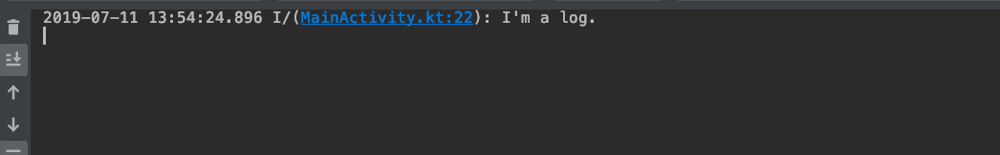
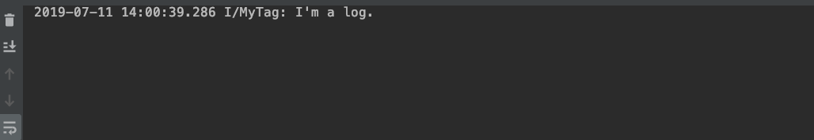
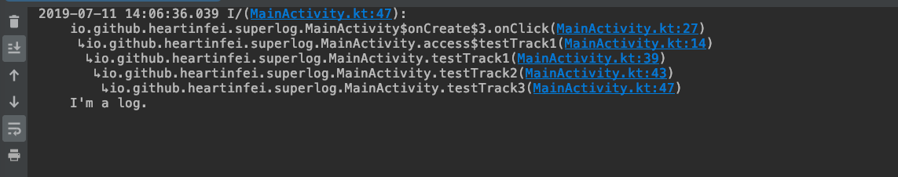

# SuperLog


### 简介

轻量级Android Log日志框架并提供强大的扩展能力，使用Kotlin实现，整体只有几K大小，你可以将它集成到你工程中，几乎不会带来任何负面影响。支持自定义输出策略，目前框架只实现了`DebugPlan`(输出到控制台)通过继承`BasePlan`可以打造满足你当前业务需要的输出策略，例如输出到文件、网络、数据库等。

### 功能说明
1. 支持Log一键定位到源码
2. 可扩展输出Log到其他介质(文件,网络,数据库等)
3. 默认使用当前类名作为Tag同时支持自定义Tag
4. 支持输出线程信息
5. 支持输出调用堆栈信息
6. 支持输出格式自定义
7. 支持多线程环境

### 使用说明

1. 集成方式

* 通过gradle集成

   ```java
  implementation 'io.github.heartinfei:slogger:2.0.4'
  ```

* 通过jar集成

  下载[jar-2004.jar](./img/superlog-2004.jar)

  

2. 初始化

在使用之前需要先调用`S.init()`方法进行初始化，同时在这里可以配置全局默认输出策略。

```java
public class SApplication extends Application {
    @Override
    public void onCreate() {
        super.onCreate();
        if (BuildConfig.DEBUG) {
            SConfiguration debugConfig = new SConfiguration()
                    .setPrintThreadInfo(false)
                    .setPrintTrackInfo(false)
                    .setTrackFilter(BuildConfig.APPLICATION_ID);
            S.init(debugConfig).addPlans(new DebugPlan());
        } else {
            //release 策略
        }
    }
}

```
> 注意: `S.init()`方法只能调用一次

3. 普通输出 
```java
//普通输出
S.i("I'm a log.");
```

其中`MainActiivity`为Log输出所在类文件名作为默认Tag名称。

4. 使用自定义Tag

```java
S.withTag("MyTag").i("I'm a log")
```
 

5. 输出线程信息

```kotlin
thread(start = true, name = "MyThread") {
		S.withThreadInfo(true).i("I'm a log.")
}
```


6. 输出堆栈信息

```kotlin
private fun testTrack1() {
    testTrack2()
}

private fun testTrack2() {
    testTrack3()
}

private fun testTrack3() {
    S.withTrackInfo(true).i("I'm a log.")
}
```



7. 其他

```kotlin
S.withTag("MyTag")
 .withPrintThreadInfo(true)
 .withPrintTrackInfo(true)
 .withTrackDeep(1)
 .withTrackFilter(BuildConfig.APPLICATION_ID)
 .i("I'm a log.")
```


### 扩展

通过继承`BasePlan`可创建自定义`Plan`，可参考`ReleasePlan`的实现，其他请参考[Demo](https://github.com/heartinfei/SLog)