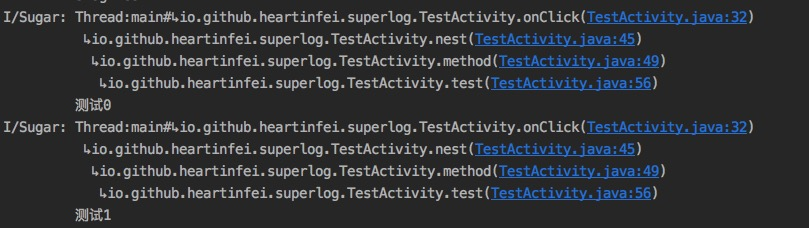

# SuperLog





轻量级Log日志框架，支持输出到控制台和文件等支持自定义扩展。
输出到文件的Log以自定义 *Tag* 作为文件名，单个日志文件限制大小为4M。
### 功能说明
1. 输出Log到控制台
2. 输出Log到文件
3. 可扩展输出Log到其他介质
4. 支持自定义Tag
5. 支持输出线程信息
6. 支持输出调用堆栈信息
7. 支持Log定位
8. 支持输出格式自定义
9. 支持多线程环境

### 使用说明

1. 添加依赖

```java
implementation 'io.github.heartinfei:slogger:1.0.4'
```

2. 初始化
```java
public class SApplication extends Application {
    @Override
    public void onCreate() {
        super.onCreate();
        S.init(this);
        if (BuildConfig.DEBUG) {
            S.addPlant(new DebugPlan());    //输出到控制台
        } else {
            S.addPlant(new ReleasePlan(path)); //输出到文件
        }
    }
}

```
3. 使用 
```
//普通输出
S.i("Test");

//Error输出
S.e(...);

//自定义Tag
S.log("MyTag","Message .....");

```

4. 自定义`Configuration`

```java
Configuration config = new Configuration.Builder(this)
               .trackInfoDeep(Integer.MAX_VALUE) //打印堆栈深度
               //确保你的包名和源码包一致,如果你的程序存在多个构建这里需要注意否则堆栈信息可能不正确
               .pkgName(BuildConfig.APPLICATION_ID)
               .tag("S_LOG")           //default is Application name
               .isPrintLineNo(true)    //打印行号 defaut true
               .isPrintTag(true)       //打印Tag defaut true
               .isPrintTrackInfo(true) //打印堆栈 defaut true
               .isPrintThreadInfo(true)//打印线程信息 defaut true
               .build();
S.addConfig(config);

```

5. 扩展Log输出方式
通过继承`BasePlan`可创建自定义`Plan`，可参考`ReleasePlan`的实现

6. 其他请参考[Demo](https://github.com/heartinfei/SLog)
